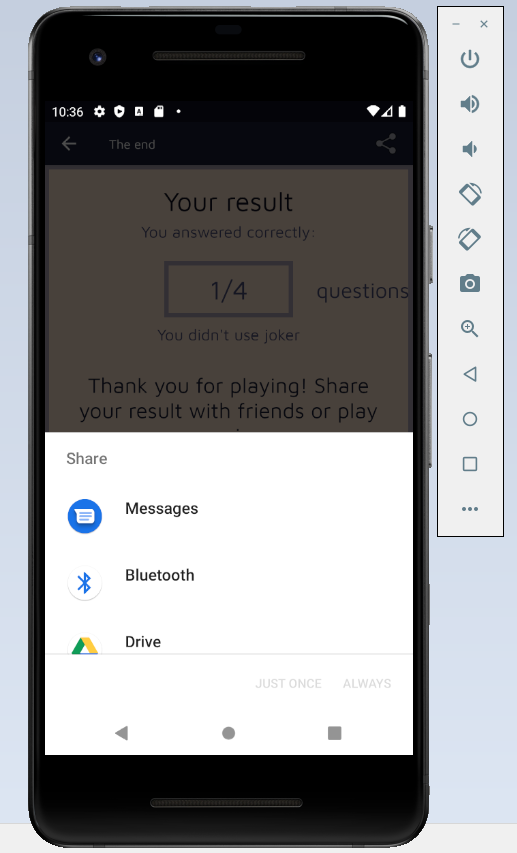

# byePy aplikacija

  
byePy quiz je aplikacija koja nudi korisnicima način da provjere svoje
znanje iz programskog jezika Python, ali i da nauče neke nove stvari.
Ovu aplikaciju karakteriše jednostavno i razumljivo korištenje, kao i
lijep, moderan izgled. Aplikacija je pisana u jeziku Kotlin i rađena u
Android Studiu. Lokalizovana je na dva jezika, engleski i bosanski
jezik.  
U nastavku će biti opisane funkcionalnosti aplikacije, njena
arhitektura, opšti koncepti Android framework-a i opis rada aplikacije
sa slikama.

>### **Arhitektura aplikacije**

Java je godinama bila prvi izbor, ali zbog potrebe za optimizacijom
izrade mobilnih aplikacija, lakoćom rada s podacima, proširivosti i zbog
pojave modernih jezikovnih značajki poput lambda funkcija, ništavnih
tipova (engl. nullable types) i tokova podataka (engl. streams), Kotlin
polako preuzima titulu vodećeg jezika za razvoj Android aplikacija. Sama
Android platforma je pisana u Javi, ali povezivanje s Kotlinom nije
problem, jer su Kotlin i Java u potpunosti interoperabilni. To znači da
se Java kod može pokretati u Kotlin datotekama i obrnuto, bez dodatnog
troška memorije ili vremena. Samim time aplikacije ne moraju biti u
potpunosti prepisane u Kotlin, već se mogu prevoditi u koracima.
Najvažnija značajka Kotlina je ta što njegove mogućnosti ne ovise o
verziji Jave koja se koristi u projektima, kao ni o verziji Androida
koja se podržava. Što je suprotan slučaj od Jave. Naime verzija Jave u
projektu ovisi o najmanjoj podržanoj verziji Androida. Nijedna novija
verzija, tj Java 8 do Java 10, nije podržana prije Android Nougata
(7.0), odnosno svega 43% uređaja podržava nove prevoditelje za JVM.
Često, u programerskom žargonu, je korišten izraz “naivno rješenje” ili
“naivna implementacija”. Taj pristup rada označava pisanje koda na način
gdje se ne očekuje previše promjena ili proširenja, gdje je kod napisan
da radi, bez previše mogućnosti mijenjanja. To je u srži vrlo loše, jer
su programska podrška, alati, platforme, programski jezici i u širokom
smislu tehnologija, stvari koje su najpodložnije brzim promjenama u ovom
modernom svijetu.U praksi je takav pristup namjerno korišten vrlo
rijetko, ali kad se pojavljuje, to gotovo uvijek bude u ista dva
slučaja, kod početnika i kod naslijeđenih projekata. Kao što je već
navedeno, naivan pristup je vrlo loš, znajući da će svaka aplikacija
barem jednom u budućnosti biti ažurirana ili dorađena. Iz tog razloga su
proizašli brojni programski oblikovni obrasci, a naposljetku iz njih i
arhitekturni obrasci poput MVC obrasca. Trenutno mjesto
najzastupljenijeg arhitekturnog obrasca u Androidu zauzima
Model-Pogled-Prezenter (engl. Model-View-Presenter, MVP) zbog
jednostavnosti, prilagodljivosti i brzine postavljanja. Vrlo je sličan
MVC-u, aplikacija je odvojena na tri sloja, na model sloj, sloj pogleda
i sloj prezentacije ili poslovne logike. Svaki sloj je precizno
definiran, njegove zadaće su usko ograničene kako bi se izbjeglo usko
vezanje ovisnosti u aplikaciji, a međusobno su povezani preko slabe
reference (engl. weak reference), najčešće preko Java ili Kotlin
sučelja. Sloj modela je korisniku najdalji i najskriveniji, predstavlja
vanjske entitete koji komuniciraju s uslugama poput baze podataka ili
mrežnog povezivanja i bavi se pretvaranjem podataka iz jednog tipa u
drugi, kako bi sloju koji prikazuje i popunjava sučelje korisniku dao
čiste podatke za rad. Sloj modela može dodatno biti raščlanjen na
podslojeve, granularizirajući strukturu još više. Sloj prezentacije ili
sloj poslovne logike se bavi povezivanjem korisničkih interakcija unutar
aplikacije, poput klikova ili pisanja, sa slojem modela, koji dalje
dohvaća podatke, pretvara ih u korisne strukture i na kraju vraća sloju
prezentacije koji ih prosljeđuje sloju pogleda. Zadaća sloja
prezentacije je i provjera primljenih podataka te reagiranje na
neispravne podatke i stanja u aplikaciji, šaljući tako zadnjem sloju,
sloju pogleda, upute koje su mu potrebne za prikazivanje odgovarajućih
poruka korisniku. Sloj pogleda ili sloj platforme je najuži dio MVP
obrasca. On služi isključivo za prikaz sučelja i podataka na sučelju i
slanje poruka vezanih uz korisničku interakciju sloju prezentacije.
Nepisano pravilo je da ovaj sloj mora biti “najgluplji”, odnosno da zna
najmanje o svojstvima i poslovnoj logici u aplikaciji. Na taj način sloj
pogleda ovisi samo o platformi i njenim pojedinostima, dok se ostali
slojevi mogu bez problema ponovno koristiti u drugim projektima ili
drugim dijelovima aplikacije.

>#### Detaljnije o arhitekturi

Sve ono što čini jednu dobru i funkcionalnu mobilnu aplikaciju je dobra
arhitektura iste, t gore opisanih i navedenih obrazaca. U nastavku će
biti opisana sama arhitektura ove aplikacije. Na slikama ispod se vidi i
sma prikaz arhitekture ove aplikacije. Da bi se uspostavila i sama
funkcionalnost aplikacije potrebno je izmedju ostalog bilo i unutar
Gradle skripte unijeti sve potrebne zavisnosti (a iste su prikazane i na
slikama).

Na slici iznad je prikazana detaljna arhitektura nase aplikacije.

Aplikacija je izradjena pomocu Fragmenata i nekih drugih dobrih praksi u
razvoju Android aplikacija. Šta su to fragmenti u androidu? Fragmenti su
dijelovi interface-a same aplikacije ili neka pozadina koja se može
koristiti unutar Activity. Interakcija sa fragmentima je uradjena kroz
FragmentManager. Fragment klasa je ta koja se koristi tačnije može se
koristiti za predstavljanje nekih kljucnih i bitnih operacija koje se
vrše nad interface-om. Kroz fragment se definise njeov lifecycle koji
zavisi od aktivnosti. Ako je aktivnost uništena svi fragmenti će biti
uništeni. Naravno da to nisu samo moćne prednosti korištenja Fragmenata,
mnogo ih je još tu. Unutar naše aplikacije smo imali više fragemanata.
Onaj koji bismo mozda izdvojili kao najbitniji mada ni drugima ne
umanjujemo bitnost jeste GameFragment. Ali da bi priča imala više
smisla, krenimo od početka. Dakle na samom početku se zajedno sa samim
projektom kreirala i MainActivity Kotlin klasa unutar koje smo
definisali neke od bitnijih aktivnsoti ove aplikacije, kao što su
promjena jezika tj lokalizaicja dva jezika itd. Nakon toga smo kreirali
i stratni fragment, pod nazivom StartFragment koji predstavlja naš
starttni fragment a detaljnije o njemu mozete naći u sklopu ov
edokumnetacije. Ovim fragmentom smo povezali pocetni ekran. Vodeci se
istim principima, za svaku od aktivnosti smo kreirali po jedan fragment.
Dakle time smo aplikaicju razvdojili po dijelovima.

Unutar svakog fragenta je definisana odredjena aktivnost za isti. Kao
što smo naveli, bez umanjenja bitnosti i ostalih korištenih fragmenata
naglasili bismo GameFragment. Zašto? Upravo je unutar njega sadržana sva
logika koju bi ovaj kviz trebao da ima. Ovim smo uvezali čitavu logiku
igrice sa korisničkim interface-om tj onim što se korisniku prikazuje.
Kada govorimo o logici same aplikacije koja što je već naglašeno
većinski je sadržana unutar GameFragmenta. Detaljnije o fragmentima se
moze unutar teksta.

Kada govorimo o čuvanja podataka koji se koriste za pitanja unutar
aplikacije, njih čuvamo U RAM-u ili u bazi podataka. Dakle nakon
kreiranje klase čiji su atributi text, code, type i answers, prešli smo
na kreiranje i samih pitanja. Unutar text čuvamo text unutar code
dijelove teksta kojji su npr isječci nekog koda, kao type čuvamo tip
pitanja dok u answers čuvamo listu odgovora mogućih. Tu su i definsane
funkcije koje treba da se izvrše nad pitanjima ali i nad GameFragmentom.
Svaki od fragmenata je povezan sa layoutom koje čuvamo unutar
res/layout. Prikaz toga je na slici ispod.

Time smo sačuvali podatke unutar naše aplikacije a koje prikazujemo
korisnicima iste.

Unutar layout-a čuvamo upravo sam izgled tj interface koji treba da se
prikazuje samim korisnicima. Tu podešavamo način prikazivanja i upravo
je to taj view dio koji bi arhitektonski sloj apliakcije trebao da ima.
Naravno, sobzirom da je aplikacija naštimana da bude korištena tj da se
može koristiti u portarit i landscape načinu, za svaki od layout-a smo
kreirali kako horizonatni tako i vertikalni layout. Kada dodjemo do
momenta okretanja emulatora tj rotiranja ekrana u zavisnoti u kome
položaju želimo koristit aplikaciju bira se jedan od layouta, bilo za
vertkialnu bilo za horizonatalnu orjentaciju. Unutar layouta je u
zavosnosti od potreba definano tj postavljane su različite komponente.

Opisanim dijelovima više u tekstu smo osigurali da imamo kreirane modele
tj modeliranje i time obezbjedili model dio aplikacije. Layoutima smo
pokrili korisnički interface i ono što se korisniku prikazuje kao i
prezentacijski dio. Čime smo obezbjedili da je arhitektonski nivo
aplikacije zadovoljen. Detaljnije, čista KOTLIN arhitektura jedne
mobilne aplikacije bi bila takva da bi imala Activity/Fragment/UI
Component što naša aplikacija ima pa smo i taj dio obezbjedili. Pored
toga potrebno je da ima i ViewModel koji također pa je još jedan
arhitektonski sloj ispunjen. Nadalje, potrebno je da ima i neku bazu
podataka bilo lokalnu bilo neki drgu pohranu podataka, što je u našem
slučaju druga pohrana podataka tj izuzeta je upotreba korištenja lokalne
baze podataka. Proces ispunjenja tako reći ovih prezentacijskih slojeva
je cirkularan u zavisnosti od User eventa.

U nastavku teksta ce biti detaljno opisano funkcionalnosti klasa, a na  
kraju i sam interface koji se u konačnici prikazuje samim korisnicima
aplikacije.

>### Opis funkcionalnosti klasa

Naša aplikacija ima ukupno 7 klasa i to: MainActivity, AboutFragment,
LearnFragment, StartFragment ChoiceFragment, GameFragment i EndFragment.

#### MainActivity

Activity klasa je krucijalna komponenta u android aplikaciji i način na
koji su aktivnosti pokrenute i sastavljene je fundamentalan dio
aplikacija. Aktivnost obezbijedi prozor u kojem aplikacija prikaže svoj
UI. Generalno, jedna aktivnost implementira jedan prozor. Da bi se
aktivnosti koristile, moraju se deklarisati u manifestu.  
U našoj klasi MainActivity podešen je NavDrawer menu u kojem su dvije
opcije: About i Learn Python. Prva opcija vodi ka prozoru na kojem je
kratak opis aplikacije, a druga opcija vodi na prozor za linkovima gdje
se može naučiti Python. Klasa sadrži i private funkcije loadLocate,
changeLanguage, setLocate koje se koriste za promjenu jezika aplikacije
preko dugmića Promijeni jezik. U layout-u activity_main nalazi se
ustvari layout fragmenta StartFragment, o kojem ćemo detaljnije nešto
kasnije.

#### O Fragmentima

Fragmenti su uvedeni primarno da bi podržali dinamičniji i fleksibilniji
UI dizajn, kao npr. na tabletima. Svaki fragment ima svoj layout i svoje
sopstvene lifecycle callback-e i jedan fragment može s euključiti u više
aktivnosti pa bi se zato trebali dizajnirati za ponovnu upotrebu. Kod
Fragment klase je sličan onom kodu iz Activity klase. U Fragmentima
trebale bi se implementirati sljedeće lifecycle metode: onCreate(),
oCreateView() i onPause().

#### AboutFragment

Ovaj fragment samo vraća svoj layout koji će se prikazati na ekranu
prilikom klika na opciju About u NavDrawer meniju.

#### LearnFragment

Ovaj fragment vraća svoj layout koji će se prikazati na ekran prilikom
klika na Learn Python opciju u NavDrawer meniju. Takođe, u layoutu ima
dugmić Learn Py koji vodi na stranicu
[Learn Python](http://www.learnpython.org). Klikom na dugmić otvara se
Intent u kojem je lista browser-a uređaja i preko kojih se može otvoriti
stranica.

#### StartFragment

Ovo je startni fragment. On vraća layout koji će se prvi prikazati nakon
pokretanja aplikacije. Postavlja listener na dugmić Play i kada se
klikne na njega pomoću navigacije vodi do ChoiceFragment-a.

#### ChoiceFragment

Ovaj fragment ima dvije privatne varijable numOfQuestions (predstavlja
broj pitanja koji će korisnik izabrati) i levelD (predstavlja težinu
kviza koju korisnik izabere). Postavljeni su onClickListener-i na
easyButton, mediumButton i hardButton. Služe za to da ako kliknemo na
jedan od ovih, pa se predomislimo, da se pozadine dugmića mijenjaju, jer
su oni u suštini radio buttons. U layout-u je takođe postavljeno polje
za unos broja pitanja. Nakon što korisnik izabere težinu, unese broj
pitanja i pritisne Ok dugmić, u fragmentu se provjerava koju je težinu
izabrao, (Easy je označena brojem 1, Medium brojem 2, a Hard brojem 3)
koji broj pitanja hoće i ta dva argumenta se putem akcije u navigaciji
šalje na naredni fragment, a to je u ovom slučaju GameFragment.

#### GameFragment

Ovo je najvažniji fragment u ovoj aplikaciji, jer sadrži cijelu logiku
igre, liste pitanja i odgovora i sve potrebne funkcije za pravilan rad i
provjeru odgovora korisnika.  
U ovom fragmentu imamo klasu Question koja sadrži atribute text,
answers, type i code. Atribut text je ustvari tekst pitanja, answers je
lista sa ponuđenim odgovorima, type je tip pitanja koji u našem slučaju
može biti choice, multiple-choice i text-answer, a code je string koji
predstavlja dio koda unutar nekih pitanja.  
Dalje imamo tri mutable liste: hardquestions, mediumquestions i
easyquestions. Hardquestions je lista koja sadrži teška pitanja raznih
tipkova, mediumquestions je lista koja sadrži srednje teška pitanja, a
easyquestions je lista lakih pitanja. Sve ove liste za tip imaju
Question. Napisane su tako da ako je u pitanju choice tip, prvi odgovor
u answers listi je tačan, ako je u pitanju text tip, date su razne
varijacije tačnog odgovora, dok ako se radi o multiple tipu, prva dva
odgovora u listi answers su tačna.  
Definisane su sljedeće varijable: currentQuestion (tipa Question,
predstavlje trenutno pitanje koje se prikazuje), answers (lista
odgovora), questionIndex (index pitanja), numQuestions (broj pitanja),
difficulty (težina), correctAnswers(broj tačnih odgovora), joker (tipa
Boolean, služi za provjeru da li je joker iskorišten), emh (string) i
checkedAnswers (lista odgovora koje je korisnik označio na
multiple-choice pitanjima).  
Sljedeće što radi ovaj fragment jeste da dohvati argumente koji su
poslani iz ChoiceFragment-a, a to su broj pitanja i težina koju je
korisnik izabrao i preko Toast widgeta to ispiše na ekranu. Dalje se
poziva funkcija randomizeQuestions() koja izmiješa pitanja i postavlja
questionIndex. Zatim se vrši binding klase na layout.  
Postavljen je onClickListener za SubmitButton. U tom listener-u
provjerava se koje odgovore je korisnik čekirao, ako su u pitanju
multiple choice pitanja i čekirane u listu, koje je zaokružio ako je u
pitanju choice tip (čuva indeks odgovora za provjeru) i tekst odgovora
ako se radi o tekstualnom pitanju. Dalje se provjerava tip trenutnog
pitanja, ako je choice i ako je izabrani odgovor jednak tačnom, povećava
se broj tačno odgovorenih pitanja. Ako je tip text, onda se provjerava
da li se string nalazi u nizu naših varijacija odgovora, a ako je tip
multiple, onda se provjerava dužina liste čekiranih odgovora i da li su
oni jednaki tačnim odgovorima sačuvanim u listama pitanja.  
Dalje, povećava se trenutni index kako bi se prešlo na sljedeće pitanje.
Ako je on manji od broja pitanja koje je korisnik izabrao, poziva se
ponovo funkcija setQuestion(), a ako je jednak broju pitanja koji je
korisnik upisao, onda prelazi na sljedeći fragment, EndFragment, kojem
prenosi parametre numOfQuest, correctAnswers i joker.  
U kvizu korisnik ima pravo da iskoristi takozvani joker, a to znači da
za pomoć može pitati prijatelja da mu pomogne oko tog pitanja. On se
može iskoristiti jednom tokom igre.  
Zbog toga se na layout-u nalazi i jokerButton. Kada korisnik klikne na
ovaj dugmić, tada se njegova vidljivost stavlja na invisible, kako se ne
bi više prikazao na ekranu i iskorištnost na true. Zatim preko Intent
otvaramo meni gdje korisnik može porukom poslati pitanje i ponuđene
odgovore (ako ih ima) prijatelju kako bi mu pomogao odgovoriti na
pitanje. U poruci se automatski generiše tekst pitanja i tekst ponuđenih
odgovora.  
Dalje u kodu imamo funkciju setLayout. Ona služi za postavljanje
vidljivosti elemenata u layout-u. Kako imamo više tipova pitanja, tako
ponuđene odgovore moramo prikazati na drugačiji način. Zbog toga je
kreirana ova funkcija. U zavisnosti od tipa trenutnog pitanja, onda
postavlja vidljiv samo onaj element koji je vezan za taj tip pitanja.
Tako smo izbjegli korištenje više layout-a koje se i ne preporučuje u
praksi. U onViewCreated pozivamo setLayout, a i na pritisak dugmića
Submit.  
Funkcija randomizeQuestions() miješa naše tri liste pitanja tj njihove
elemente, postavi questionIndex na nulu i pozove funkciju setQuestion().
Zatim u zavisnosti od težine koju je korisnik izabrao, funkcija
setQuestion() postavlja na kojim indeksima će se izabrati pitanje iz
neke od tri naše liste. Pa tako ako se radi o težini Easy, tada će oko
50% pitanja biti iz easyquestions liste, a oko po 25% iz mediumquestions
i hardquestions lista. To je postavljeno štimanjem indeksa preko broja
pitanja koji je korisnik upisao. Dalje ova funkcija randomizira odgovore
trenutnog pitanja, promiješa ih i u layout-u ispiše koje je pitanje po
redu npr. 4/6 (znači četvrto od ukupno 6 pitanja).  
Ovo bi bila detaljnija analiza našeg GameFragmenta.

#### EndFragment

Na kraju, opisat ćemo funkcionalnost EndFragment-a. Ovaj fragment ima
varijablu corrAns koja predstavlja broj tačnih odgovora korisnika. Ta
varijabla se postavi preko argumenata poslanih iz GameFragmenta, gdje je
već izračunat broj tačnih odgovora korisnika. Takođe, preko Toast
widget-a prikaže korisniku na dnu broj tačnih. U layout-u prikaže koliko
ima tačnih odgovora od ukupnog broja pitanja i ispiše određene poruke u
zavisnosti da li je korisnik na sva pitanja odgovorio tačno, na više od
0 ili ako nije ni na jedno. Takođe, ukoliko je joker iskorišten ili ne
ispiše prikladnu poruku. U toolbaru-u ovog fragmenta je Share dugmić
kojim korisnik može share-ati svoj rezultat.

>### Slike rada aplikacije / Korisnički interfaceTokom
> Prilikom rada na aplikacji je implementiran kako horizontalni tako i
> vertikalni layout. U tekstu ispod je prikaz oba layouta.

#### **Vertikalni layout**

Korisnik ima mogućnost izbora jezika bilo engleskog bilo bosanskog. Na
slici je prikazano šta se desi kada korisnik promjeni jezik na bosanski
s obzirom da je aplikcija namjenjenja bosanskom i engleskom jeziku.

Također korisnik može da pročita nešto više o samoj aplikaciji kao i da
nauči nešto više o Pythonu, a sve to se nalazi u bočnom meniju. Sve gore
navedeno je prikazano na slikama ispod.

 

U momentu kada korisnik pritisne PLAY/IGRAJ dugme ima mogućnost izbora
težine igrice kao i da odluči sa koliko pitanja će odigrati kviz.

Nakon što je korisnik izabarao težinu koju želi da odigra te broj
pitanja kviz počinje. Kao što je već u tekstu navedeno korisniku su
ponuđena pitanja različitog tipa. Pitanja se razlikuju po tipu bilo da
se radi o tekstualnom pitanju, pitanju višestrukog izbora (jedan ili
više ponuđenih odgovora), te pitanja kod kojih se ispisuje odredjeni dio
koda. Prikaz samog kviza je prikazan na slikama ispod. Na prvoj slici su
prikazana pitanja višestrukog izbora, gdje korisnik može izabrati samo
jedan tačan odgovor. Na drugoj slici je prikazan tipa pitanja gdje se
korisniku omogućava da izabere više tačnih ponuđenih odgovora. Treća
slika prikazuje dio u kome se korisniku ispisuje dio koda i pita ga se
šta tačno taj dio koda ispisuje. Na kraju je prikazan tekstualni tip
pitanja.

 
 

Također kako je već navedeno korisniku se omogućava i da odigra na
"kartu spasa" tj joker. Šta je to joker? Joker u ovome slučaju
predstavlja mogućnost da korisnik posalje pitanje prijatelju i time se
spasi netačnog odgovora.

 

Mimo ovoga oogućeno je i korisniku da share-a (podijeli) svoj rezultat.
Ta mogućnost rada je prikazana na slikama ispod.

 

> >##### **Horizontalni layout**
> Kao što smo već naveli s obzirom da je omogućen i horizontalni
> prikaznjega ćemo samo prikazati uz pomoć slika ispod, s obzriom da je
> sve već rečeno u tekstu iznad.

  
  
  
  
  

